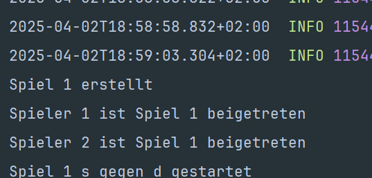

# Game Microservice

## Hauptfunktionen
- Spielerstellung und -verwaltung
- Spielstatusüberwachung
- Gewinnerermittlung
- Kommunikation mit Player und Ship Microservices

## Technologien
- Spring Boot
- H2 In-Memory Database
- RabbitMQ für Event-basierte Kommunikation
- Resilience4j für Circuit Breaking
- RestTemplate für synchrone Kommunikation

## Docker & RabbitMQ Konfiguration
Der Microservice wurde mit einem RabbitMQ-Container in Docker getestet und läuft damit problemlos. Die Konfiguration:
docker run -d --name rabbitmq -p 5672:5672 -p 15672:15672 rabbitmq:3-management

## API-Endpunkte
- `POST /game` - Erstellt ein neues Spiel
- `GET /game/{id}` - Ruft Spielinformationen ab
- `GET /game/{gameId}/status` - Überprüft den Spielstatus
- `POST /game/{gameId}/addPlayer/{playerId}` - Fügt einen Spieler zum Spiel hinzu

## Event-basierte Kommunikation
- **Publizierte Events**:
  - `player.joined` - Wenn ein Spieler einem Spiel beitritt
  - `game.over` - Wenn ein Spiel beendet ist
- **Gehörte Events**:
  - `ship.sunk` - Wenn ein Schiff versenkt wurde

## Konfiguration
- Port: 8081
- H2 Console: http://localhost:8081/h2-console
- RabbitMQ: Standardkonfiguration (localhost:5672)

## Beweis

