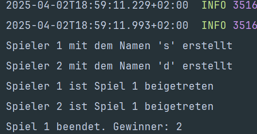

# Player Microservice

## Übersicht
Der Player Microservice verwaltet Spielerinformationen und deren Teilnahme an Spielen.

## Hauptfunktionen
- Spielererstellung
- Spielerinformationen abrufen
- Integration mit dem Game Microservice

## Technologien
- Spring Boot
- H2 In-Memory Database
- RabbitMQ für Event-basierte Kommunikation
- Resilience4j für Circuit Breaking
- RestTemplate für synchrone Kommunikation

## Docker & RabbitMQ Konfiguration
Der Microservice wurde mit einem RabbitMQ-Container in Docker getestet und läuft damit problemlos. Die Konfiguration:
docker run -d --name rabbitmq -p 5672:5672 -p 15672:15672 rabbitmq:3-management

## API-Endpunkte
- `POST /players` - Erstellt einen neuen Spieler
- `GET /players/{id}` - Ruft Spielerinformationen ab

## Event-basierte Kommunikation
- **Gehörte Events**:
  - `player.joined` - Loggt wenn ein Spieler einem Spiel beitritt
  - `game.over` - Loggt das Spielende

## Circuit Breaker
- Fallback-Methode erstellt einen Dummy-Spieler, wenn der Game Service nicht verfügbar ist

## Konfiguration
- Port: 8082
- H2 Console: http://localhost:8082/h2-console
- RabbitMQ: Standardkonfiguration (localhost:5672)

## Beweis

