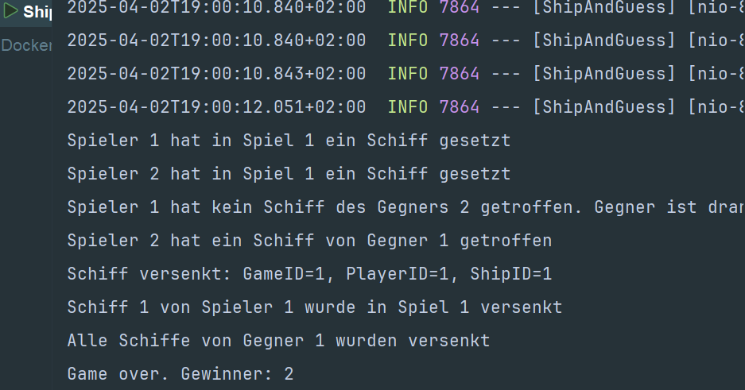

# Ship and Guess Microservice

## Hauptfunktionen
- Schiffplatzierung
- Schussverarbeitung
- Treffererkennung
- Versenkungslogik

## Technologien
- Spring Boot
- H2 In-Memory Database
- RabbitMQ für Event-basierte Kommunikation
- Resilience4j für Circuit Breaking
- RestTemplate für synchrone Kommunikation

## Docker & RabbitMQ Konfiguration
Der Microservice wurde mit einem RabbitMQ-Container in Docker getestet und läuft damit problemlos. Die Konfiguration:
docker run -d --name rabbitmq -p 5672:5672 -p 15672:15672 rabbitmq:3-management

## API-Endpunkte
- `POST /ships` - Platziert ein Schiff
- `GET /ships` - Ruft Schiffe eines Spielers ab
- `POST /guesses` - Verarbeitet einen Schuss

## Event-basierte Kommunikation
- **Publizierte Events**:
  - `ship.sunk` - Wenn ein Schiff versenkt wurde
- **Gehörte Events**:
  - `ship.sunk` - Loggt versenkte Schiffe
  - `game.over` - Loggt das Spielende

## Besondere Features
- Validierung der Schiffspositionen
- Board-Größenkonfiguration (10x10)
- Ausführliche Logging für Spielabläufe

## Konfiguration
- Port: 8083
- H2 Console: http://localhost:8083/h2-console
- RabbitMQ: Standardkonfiguration (localhost:5672)

## Beweis
